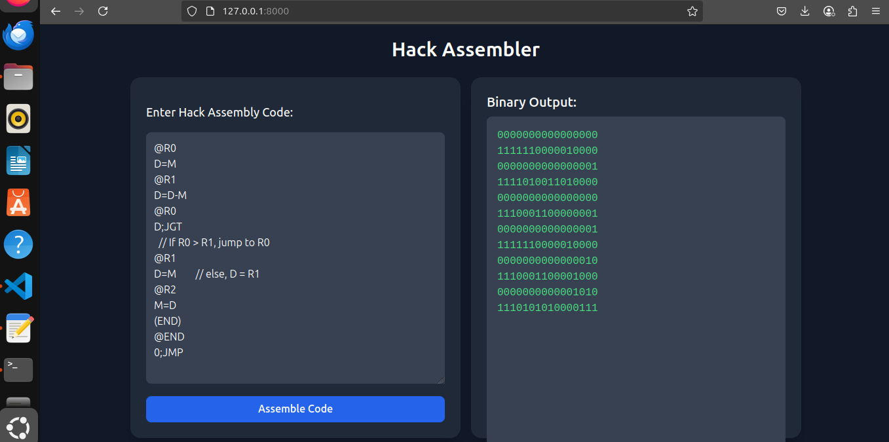

# Nand2Tetris Project 6 – Assembler (Hack)

This README documents part of **Project 6 from the Nand2Tetris book**, where I implemented an assembler in PHP/laravel that translates Hack assembly language into binary machine code. Below is the full explanation of how my implementation works, written in my own style and notes.

---

```php
protected array $symbolTable = [];
 private array $predefined = [
    'SP' => 0,
    'LCL' => 1,
    'ARG' => 2,
    'THIS' => 3,
    'THAT' => 4,
    'R0' => 0,
   //etc..
];
public function __construct()
{
    $this->symbolTable = $this->predefined;
}

I'm populating the symbol table with the predefined array, since these symbols have fixed memory addresses.
 I also add user-defined symbols dynamically later.

private array $comp = [
    '0' => '0101010',
    '1' => '0111111',
    '-1' => '0111010',
    'D' => '0001100',
    //etc..
];

private array $dest = [
    '' => '000',
    'M' => '001',
    'D' => '010',
    //etc..
];

private array $jump = [
    '' => '000',
    'JGT' => '001',
    'JEQ' => '010',
    //etc..
];
I mapped each assembly mnemonic to its corresponding binary value.


 public function assemble(string $code): string
    {
        $lines = explode("\n", $code);
        $cleaned = $this->cleanLines($lines);
        $this->register($cleaned);
        return $this->generate($cleaned);
    }
    
    private function cleanLines(array $lines): array
    {
        return array_values(array_filter(array_map(function ($line) {
            $line = trim($line);
            return ($line === '' || str_starts_with($line, '//')) ? null : explode('//', $line)[0];
        }, $lines)));
    }

I cleaned the input from comments and whitespace, then run the register function to register labels and the genrate function to generate binary.

 private function register(array $lines): void
    {

        $romAddress = 0;  
        foreach ($lines as $line) {
            if (preg_match('/^\((.+)\)$/', $line, $matches)) {
          
                $this->symbolTable[$matches[1]] = $romAddress;
             
            } else {
               
                $romAddress++;
            }
        }
    }
 In the register function, I nedded to store labels in the symbol table with their corresponding rom addresses.
 If the line is not a label, I increment the address, since it means it takes up memory space.

private function generate(array $lines): string
    {
       
        $binary = [];

        foreach ($lines as $line) {
            if (preg_match('/^\(.+\)$/', $line)) continue; 
            if (str_starts_with($line, '@')) { 
                $symbol = substr($line, 1); //@R0 -> R0
                $address = $this->userSymbol($symbol);
           
                $binary[] = str_pad(decbin($address), 16, '0', STR_PAD_LEFT);
            } else {
                $binary[] = '111' . $this->translateCInstruction($line); 
            }
        }

        return implode("\n", $binary);
    }

In the generate function, if it's an A instruction I convert it to a 16 bit binary address.
Otherwise, it's a C instruction and I translate it using the comp, dest, and jump mappings.


  private function userSymbol(string $symbol): int
    {
        if (is_numeric($symbol)) return (int)$symbol;

      
        if (!isset($this->symbolTable[$symbol])) {
            $this->symbolTable[$symbol] = $this->nextAddress++;
        }

        return $this->symbolTable[$symbol];
    }
 If the symbol is a number, I just return it as an integer.
 If it's a variable and not already in the symbol table,
I assign it to the next available memory address starting from 16.
   private int $nextAddress = 16;
 Then I increment the counter for the next variable.


     private function translateCInstruction(string $line): string
    {
    $dest = '';
    $comp = '';
    $jump = '';
    if (str_contains($line, '=') && str_contains($line, ';')) {
        [$destPart, $rest] = explode('=', $line);
        [$compPart, $jumpPart] = explode(';', $rest);
        $dest = $destPart;
        $comp = $compPart;
        $jump = $jumpPart;

    } elseif (str_contains($line, '=')) {
        [$dest, $comp] = explode('=', $line);

    } elseif (str_contains($line, ';')) {
        [$comp, $jump] = explode(';', $line);

    } else {
        $comp = $line;
    }

    $compBinary = $this->comp[trim($comp)] ?? '0000000'; 
    $destBinary = $this->dest[trim($dest)] ?? '000'; 
    $jumpBinary = $this->jump[trim($jump)] ?? '000'; 

    return $compBinary . $destBinary . $jumpBinary;
    }
    I initialized dest, comp, and jump to empty strings in case the instruction lacks some parts.
Then I handle all 4 possible formats: dest=comp;jump, dest=comp, comp;jump, and only comp.
 Finally, I used the predefined mappings and default to zeros if any part is missing as a safe net.
